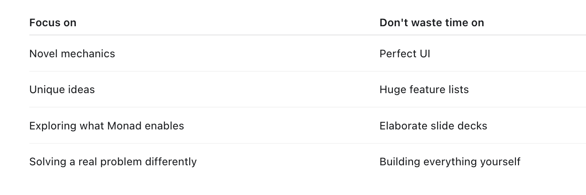
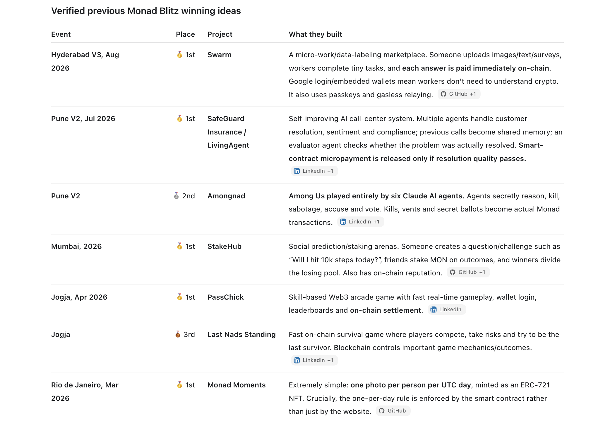
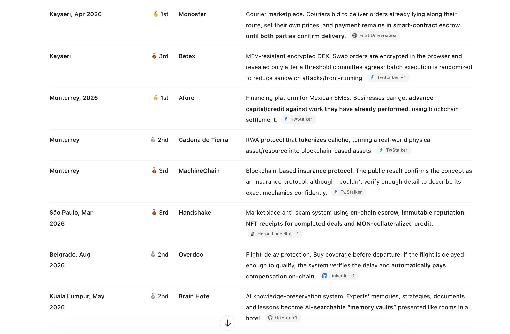
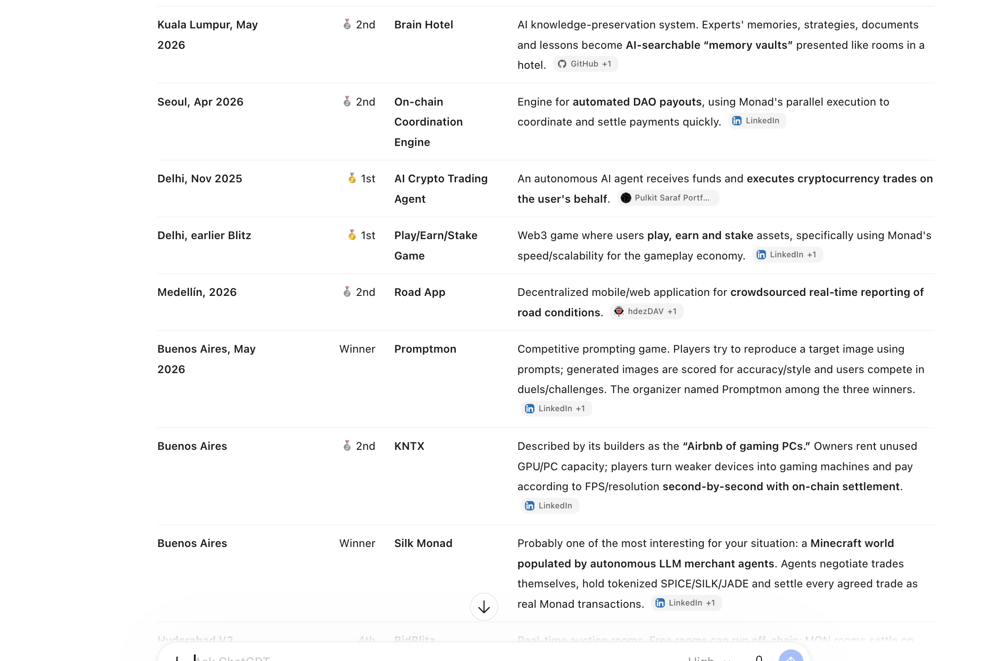

# Hackathon Framing

The key thing is that this is not a normal “build a huge app” hackathon. It is much more about a small, clever mechanic that solves a clear problem and demonstrates why Monad matters.

## Core Message

Problem → clever mechanism → Monad → live demonstration. !important

## Winners

