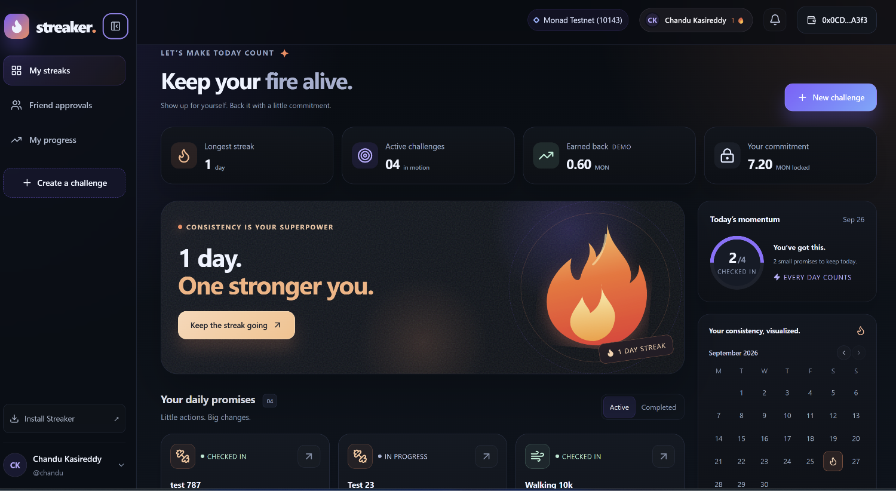

<div align="center">
  <h1>🐉 Dracarys | Streaker</h1>
  <p><b>Social Habit Staking Protocol on Monad Blockchain</b></p>
  <p><i>"Feed the flame every day or get burned."</i></p>

  <p>
    <a href="https://monad.xyz"></a>
    <a href="https://nextjs.org"></a>
    <a href="https://fastapi.tiangolo.com"></a>
    <a href="https://soliditylang.org"></a>
  </p>

  <br />

  

  <br />
  <br />
</div>

---

## 🌟 Overview

**Dracarys (Streaker)** helps people build habits with financial commitments backed by **Monad**'s sub-second execution speeds. 

Users lock micro-stakes (e.g., `0.05 MON/day`). Daily proof submissions and peer approvals unlock instant micro-payouts, while slacking burns the stake to the pool and faithful friends.

*Built for the **Monad Blitz Berlin Hackathon**.*

---

## 🚀 Key Features

<table>
  <tr>
    <td width="50%">
      <h3>🔥 Habit Staking Escrow</h3>
      <p>Lock MON stakes for 7, 14, 21, or 30 days. Earn your daily stake back with each verified check-in.</p>
    </td>
    <td width="50%">
      <h3>🤝 Peer Approval Workflow</h3>
      <p>Social verification system where accountability buddies verify daily proof photos/notes before payouts are triggered.</p>
    </td>
  </tr>
  <tr>
    <td width="50%">
      <h3>⚡ Sub-Second Monad Payouts</h3>
      <p>Leverages Monad testnet smart contract escrow (<code>DracarysEscrow.sol</code>) for instant reward distribution.</p>
    </td>
    <td width="50%">
      <h3>📱 Mobile-First PWA & Web App</h3>
      <p>Fully responsive progressive web app (PWA) with install prompts, desktop & mobile optimized controls.</p>
    </td>
  </tr>
</table>

---

## 🛠️ Tech Stack & Architecture

| Layer | Technology | Description |
| :--- | :--- | :--- |
| **Smart Contract** | Solidity 0.8.20 / Hardhat | `DracarysEscrow.sol` escrow vault, proof tracking, peer approval, slash/payout logic |
| **Frontend** | Next.js 14, TypeScript, Viem, Wagmi, Tailwind / CSS | Responsive UI, Web3 wallet connector, local & contract state hooks |
| **Backend API** | FastAPI (Python), Neon PostgreSQL | User authentication, streak invitations, proof storage, activity feeds |
| **Blockchain** | Monad Testnet (`Chain ID: 10143`) | High-throughput 10,000 TPS EVM execution |

```text
┌─────────────────────────┐          ┌───────────────────────────┐
│     Next.js Frontend    │ ◄──────► │     FastAPI Backend       │
│  (UI, Viem, Wagmi Wallet)│          │  (PostgreSQL, Invitations)│
└────────────┬────────────┘          └───────────────────────────┘
             │
             ▼
┌────────────────────────────────────────────────────────────────┐
│             Monad Testnet (Chain ID: 10143)                    │
│     DracarysEscrow.sol (Staking Vault & Instant Payouts)       │
└────────────────────────────────────────────────────────────────┘
```

---

## ⚡ Monad Testnet Deployment

| Parameter | Value |
| :--- | :--- |
| **Network Name** | Monad Testnet |
| **Chain ID** | `10143` |
| **Currency Symbol** | `MON` |
| **RPC URL** | `https://testnet-rpc.monad.xyz` |
| **Contract Address** | [`0x77547711ea2726F16C8BCeDD37a347C139D346E7`](https://testnet.monadvision.com/address/0x77547711ea2726F16C8BCeDD37a347C139D346E7) |
| **Deployment Tx** | [`0x3f343b0fd404bca74230852e7f2c0aad4338a8959f42a9bcaa4c5893081c779f`](https://testnet.monadvision.com/tx/0x3f343b0fd404bca74230852e7f2c0aad4338a8959f42a9bcaa4c5893081c779f) |

---

## 📖 How To Use The App

1. **Create a Challenge**: Select a habit, choose duration (7–30 days), and set your daily MON commitment.
2. **Invite Accountability Buddies**: Share your unique invite code or send direct in-app invitations to registered friends.
3. **Daily Check-In**: Upload proof (photo or note) daily to maintain your active streak.
4. **Peer Approval**: Friends review your proof in the **Friend Approvals** tab. A single approval triggers an instant sub-second MON payout on Monad.
5. **Track Progress**: Monitor total streaks, earned rewards, and milestones in **My Progress**.

---

## 🏃 Quick Start Guide

### 1. Run The Frontend

Requirements: **Node.js 20.9+**

```bash
cd Frontend
npm install
npm run dev
```

Open [http://localhost:3000](http://localhost:3000).

Production checks & tests:
```bash
npm run typecheck
npm run build
```

### 2. Run The Backend

```bash
cd backend
python -m venv .venv

# Activate environment:
# Windows: .venv\Scripts\activate
# Linux/macOS: source .venv/bin/activate

pip install -r requirements.txt
python run.py
```

API runs at `http://127.0.0.1:8000`. Interactive docs available at `http://127.0.0.1:8000/docs`.

### 3. Smart Contract Verification & Testing

```bash
cd contracts
npm install
npx hardhat test
```

---

## 👥 Team - Dracarys 🚀

- **Chandrakiran Reddy**
- **Abubaker**
- **Abdul Jalil**
